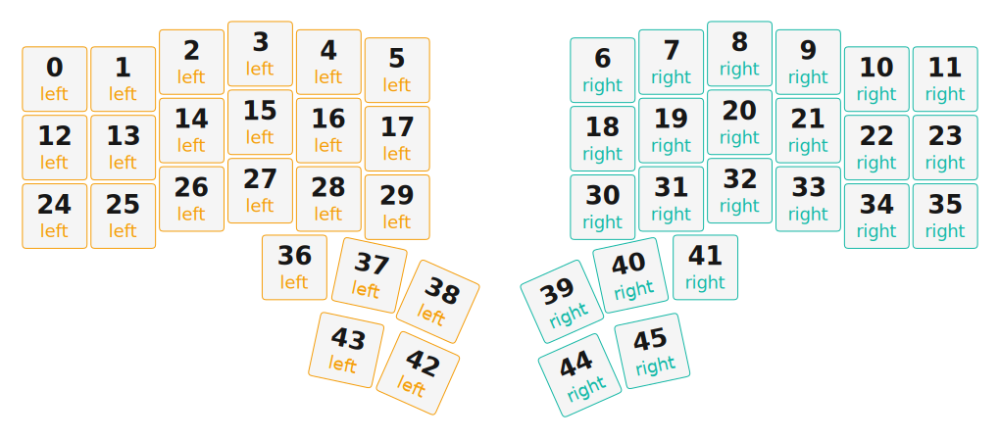

# ZMK Configuration for cosmos

*Generated by Shield Wizard for ZMK*



Download compiled firmware from the Actions tab. <https://zmk.dev/docs/user-setup#installing-the-firmware>

Edit your keymap <https://zmk.dev/docs/keymaps>.
User keymap is located at [`config/cosmos.keymap`](config/cosmos.keymap).

-----

<details>
<summary>
Shield Wizard Debug Information
</summary>

In case of broken configuration, here is the Shield Wizard internal data used to generate this configuration:

Commit: 5840d41ac0915092c8fe45da617ffb4bb91e1b97

```json
{"name":"cosmos","shield":"cosmos","dongle":false,"modules":[],"layout":[{"id":"01KNWBZWNGMKJRYW0QDPDBQQ37","part":0,"row":0,"col":0,"w":1,"h":1,"x":0,"y":0.37,"r":0,"rx":0,"ry":0},{"id":"01KNWBZWNG09D080F8WKBZJ602","part":0,"row":0,"col":1,"w":1,"h":1,"x":1,"y":0.37,"r":0,"rx":0,"ry":0},{"id":"01KNWBZWNGYY2HS5AATYPBXAFV","part":0,"row":0,"col":2,"w":1,"h":1,"x":2,"y":0.12,"r":0,"rx":0,"ry":0},{"id":"01KNWBZWNGRRC2EMXMHXXPBSDM","part":0,"row":0,"col":3,"w":1,"h":1,"x":3,"y":0,"r":0,"rx":0,"ry":0},{"id":"01KNWBZWNGZTD3D9R8FGQZES2A","part":0,"row":0,"col":4,"w":1,"h":1,"x":4,"y":0.12,"r":0,"rx":0,"ry":0},{"id":"01KNWBZWNG9556JXZJ0QTNMXA7","part":0,"row":0,"col":5,"w":1,"h":1,"x":5,"y":0.24,"r":0,"rx":0,"ry":0},{"id":"01KNWBZWNGENF3ACARFT77D4X7","part":1,"row":0,"col":6,"w":1,"h":1,"x":8,"y":0.24,"r":0,"rx":0,"ry":0},{"id":"01KNWBZWNG9FJ0ZSBH8E7746TR","part":1,"row":0,"col":7,"w":1,"h":1,"x":9,"y":0.12,"r":0,"rx":0,"ry":0},{"id":"01KNWBZWNGQ2ZA25W7KNYA77QZ","part":1,"row":0,"col":8,"w":1,"h":1,"x":10,"y":0,"r":0,"rx":0,"ry":0},{"id":"01KNWBZWNGSWHPXZW1XSMDGTX2","part":1,"row":0,"col":9,"w":1,"h":1,"x":11,"y":0.12,"r":0,"rx":0,"ry":0},{"id":"01KNWBZWNG1PQG49ZNMEK5CX2B","part":1,"row":0,"col":10,"w":1,"h":1,"x":12,"y":0.37,"r":0,"rx":0,"ry":0},{"id":"01KNWBZWNG42SZ7XMV13VZ308D","part":1,"row":0,"col":11,"w":1,"h":1,"x":13,"y":0.37,"r":0,"rx":0,"ry":0},{"id":"01KNWBZWNG7S95NG1MJ4P8AMES","part":0,"row":1,"col":0,"w":1,"h":1,"x":0,"y":1.37,"r":0,"rx":0,"ry":0},{"id":"01KNWBZWNGVB8Q1EPPPXS4ZA08","part":0,"row":1,"col":1,"w":1,"h":1,"x":1,"y":1.37,"r":0,"rx":0,"ry":0},{"id":"01KNWBZWNGSVYYXR53PMS57H3E","part":0,"row":1,"col":2,"w":1,"h":1,"x":2,"y":1.12,"r":0,"rx":0,"ry":0},{"id":"01KNWBZWNGE1QPA8233YRHECTA","part":0,"row":1,"col":3,"w":1,"h":1,"x":3,"y":1,"r":0,"rx":0,"ry":0},{"id":"01KNWBZWNGS8DVC20QMT9NXEAM","part":0,"row":1,"col":4,"w":1,"h":1,"x":4,"y":1.12,"r":0,"rx":0,"ry":0},{"id":"01KNWBZWNGKX0RWKDH1D9YSYG2","part":0,"row":1,"col":5,"w":1,"h":1,"x":5,"y":1.24,"r":0,"rx":0,"ry":0},{"id":"01KNWBZWNGB37YZ2GBVSSGVMK3","part":1,"row":1,"col":6,"w":1,"h":1,"x":8,"y":1.24,"r":0,"rx":0,"ry":0},{"id":"01KNWBZWNGYV1DYHX41QWM042D","part":1,"row":1,"col":7,"w":1,"h":1,"x":9,"y":1.12,"r":0,"rx":0,"ry":0},{"id":"01KNWBZWNG7HZ9JBH0T8YYF72W","part":1,"row":1,"col":8,"w":1,"h":1,"x":10,"y":1,"r":0,"rx":0,"ry":0},{"id":"01KNWBZWNGH4H5SCHKR51TT8EK","part":1,"row":1,"col":9,"w":1,"h":1,"x":11,"y":1.12,"r":0,"rx":0,"ry":0},{"id":"01KNWBZWNGE7V0JZBJVCKMSH83","part":1,"row":1,"col":10,"w":1,"h":1,"x":12,"y":1.37,"r":0,"rx":0,"ry":0},{"id":"01KNWBZWNG9NSMC9G91Z3FZKC3","part":1,"row":1,"col":11,"w":1,"h":1,"x":13,"y":1.37,"r":0,"rx":0,"ry":0},{"id":"01KNWBZWNGB43HG83PP2Q4RW4Y","part":0,"row":2,"col":0,"w":1,"h":1,"x":0,"y":2.37,"r":0,"rx":0,"ry":0},{"id":"01KNWBZWNG5A1JDP0GM2Y6N4W5","part":0,"row":2,"col":1,"w":1,"h":1,"x":1,"y":2.37,"r":0,"rx":0,"ry":0},{"id":"01KNWBZWNG9K46ZC9P2X5N54T2","part":0,"row":2,"col":2,"w":1,"h":1,"x":2,"y":2.12,"r":0,"rx":0,"ry":0},{"id":"01KNWBZWNGVZPN880CJF961CN5","part":0,"row":2,"col":3,"w":1,"h":1,"x":3,"y":2,"r":0,"rx":0,"ry":0},{"id":"01KNWBZWNGK4JG1P5WTCZKKS5Q","part":0,"row":2,"col":4,"w":1,"h":1,"x":4,"y":2.12,"r":0,"rx":0,"ry":0},{"id":"01KNWBZWNGGR8JTKS293THSDY0","part":0,"row":2,"col":5,"w":1,"h":1,"x":5,"y":2.24,"r":0,"rx":0,"ry":0},{"id":"01KNWBZWNGZTK9ZCEAM3529XCA","part":1,"row":2,"col":6,"w":1,"h":1,"x":8,"y":2.24,"r":0,"rx":0,"ry":0},{"id":"01KNWBZWNGXHG4REDD5CD58E79","part":1,"row":2,"col":7,"w":1,"h":1,"x":9,"y":2.12,"r":0,"rx":0,"ry":0},{"id":"01KNWBZWNGPSBVGWY6RYRA5WJ4","part":1,"row":2,"col":8,"w":1,"h":1,"x":10,"y":2,"r":0,"rx":0,"ry":0},{"id":"01KNWBZWNG5CVK4AK9KESAQJPP","part":1,"row":2,"col":9,"w":1,"h":1,"x":11,"y":2.12,"r":0,"rx":0,"ry":0},{"id":"01KNWBZWNG7Z8X06HCA43Y1NCX","part":1,"row":2,"col":10,"w":1,"h":1,"x":12,"y":2.37,"r":0,"rx":0,"ry":0},{"id":"01KNWBZWNGN4QJETDHA6NQ1KGR","part":1,"row":2,"col":11,"w":1,"h":1,"x":13,"y":2.37,"r":0,"rx":0,"ry":0},{"id":"01KNWBZWNGSSRT07GKSWFME06J","part":0,"row":3,"col":3,"w":1,"h":1,"x":3.5,"y":3.12,"r":0,"rx":0,"ry":0},{"id":"01KNWBZWNGB914RBGSPTE4FRCX","part":0,"row":3,"col":4,"w":1,"h":1,"x":4.5,"y":3.12,"r":12,"rx":4.5,"ry":4.12},{"id":"01KNWBZWNG46X7QEK7SC0FSFMT","part":0,"row":3,"col":5,"w":1,"h":1,"x":5.23,"y":3.33,"r":24,"rx":5.23,"ry":4.83},{"id":"01KNWBZWNGFJCDJQ6YV4RMRA0D","part":1,"row":3,"col":6,"w":1,"h":1,"x":7.77,"y":3.33,"r":-24,"rx":8.77,"ry":4.83},{"id":"01KNWBZWNGPFXQDCZ1P0RFTE14","part":1,"row":3,"col":7,"w":1,"h":1,"x":8.5,"y":3.12,"r":-12,"rx":9.5,"ry":4.12},{"id":"01KNWBZWNG0GS1KQG26T1PH52D","part":1,"row":3,"col":8,"w":1,"h":1,"x":9.5,"y":3.12,"r":0,"rx":0,"ry":0},{"id":"01KNWCRRGWK3ENX61K1SX7C3Q1","part":0,"row":4,"col":4,"w":1,"h":1,"x":5.25,"y":4.75,"r":24,"rx":5.98,"ry":5.33},{"id":"01KNWCRPSE72K2FWS99HSSAY3B","part":0,"row":4,"col":5,"w":1,"h":1,"x":4.3,"y":4.5,"r":12,"rx":5.6,"ry":4.7},{"id":"01KNWCRS7KNHZ2PGJD79VF0X9H","part":1,"row":4,"col":6,"w":1,"h":1,"x":7.5,"y":5.75,"r":-24,"rx":5.6,"ry":5.33},{"id":"01KNWCRSR9KH8N7NB79QXQ77SN","part":1,"row":4,"col":7,"w":1,"h":1,"x":8.7,"y":4.28,"r":-12,"rx":9.5,"ry":4.7}],"parts":[{"name":"left","controller":"nice_nano_v2","wiring":"matrix_diode","pins":{"d8":"input","d7":"input","d6":"input","d5":"input","d4":"input","d19":"output","d18":"output","d15":"output","d14":"output","d16":"output","d10":"output"},"keys":{"01KNWBZWNGMKJRYW0QDPDBQQ37":{"input":"d4","output":"d19"},"01KNWBZWNG7S95NG1MJ4P8AMES":{"input":"d5","output":"d19"},"01KNWBZWNGVB8Q1EPPPXS4ZA08":{"input":"d5","output":"d18"},"01KNWBZWNGSVYYXR53PMS57H3E":{"input":"d5","output":"d15"},"01KNWBZWNGE1QPA8233YRHECTA":{"input":"d5","output":"d14"},"01KNWBZWNGS8DVC20QMT9NXEAM":{"input":"d5","output":"d16"},"01KNWBZWNGKX0RWKDH1D9YSYG2":{"input":"d5","output":"d10"},"01KNWBZWNG09D080F8WKBZJ602":{"input":"d4","output":"d18"},"01KNWBZWNGYY2HS5AATYPBXAFV":{"input":"d4","output":"d15"},"01KNWBZWNGRRC2EMXMHXXPBSDM":{"input":"d4","output":"d14"},"01KNWBZWNGZTD3D9R8FGQZES2A":{"input":"d4","output":"d16"},"01KNWBZWNG9556JXZJ0QTNMXA7":{"input":"d4","output":"d10"},"01KNWBZWNGB43HG83PP2Q4RW4Y":{"input":"d6","output":"d19"},"01KNWBZWNG5A1JDP0GM2Y6N4W5":{"input":"d6","output":"d18"},"01KNWBZWNG9K46ZC9P2X5N54T2":{"input":"d6","output":"d15"},"01KNWBZWNGVZPN880CJF961CN5":{"input":"d6","output":"d14"},"01KNWBZWNGK4JG1P5WTCZKKS5Q":{"input":"d6","output":"d16"},"01KNWBZWNGGR8JTKS293THSDY0":{"input":"d6","output":"d10"},"01KNWBZWNGSSRT07GKSWFME06J":{"input":"d7","output":"d14"},"01KNWBZWNGB914RBGSPTE4FRCX":{"input":"d7","output":"d16"},"01KNWBZWNG46X7QEK7SC0FSFMT":{"input":"d7","output":"d10"},"01KNWCRPSE72K2FWS99HSSAY3B":{"input":"d8","output":"d16"},"01KNWCRRGWK3ENX61K1SX7C3Q1":{"input":"d8","output":"d10"}},"encoders":[],"buses":[{"name":"spi0","devices":[],"type":"spi"},{"name":"spi1","devices":[],"type":"spi"},{"name":"spi2","devices":[],"type":"spi"},{"name":"spi3","devices":[],"type":"spi"},{"name":"i2c0","devices":[],"type":"i2c"},{"name":"i2c1","devices":[],"type":"i2c"}]},{"name":"right","controller":"nice_nano_v2","wiring":"matrix_diode","pins":{"d8":"input","d7":"input","d6":"input","d5":"input","d4":"input","d19":"output","d18":"output","d15":"output","d14":"output","d16":"output","d10":"output"},"keys":{"01KNWBZWNGENF3ACARFT77D4X7":{"input":"d4","output":"d10"},"01KNWBZWNG9FJ0ZSBH8E7746TR":{"input":"d4","output":"d16"},"01KNWBZWNGQ2ZA25W7KNYA77QZ":{"input":"d4","output":"d14"},"01KNWBZWNGSWHPXZW1XSMDGTX2":{"input":"d4","output":"d15"},"01KNWBZWNG1PQG49ZNMEK5CX2B":{"input":"d4","output":"d18"},"01KNWBZWNG42SZ7XMV13VZ308D":{"input":"d4","output":"d19"},"01KNWBZWNGB37YZ2GBVSSGVMK3":{"input":"d5","output":"d10"},"01KNWBZWNGYV1DYHX41QWM042D":{"input":"d5","output":"d16"},"01KNWBZWNG7HZ9JBH0T8YYF72W":{"input":"d5","output":"d14"},"01KNWBZWNGH4H5SCHKR51TT8EK":{"input":"d5","output":"d15"},"01KNWBZWNGE7V0JZBJVCKMSH83":{"input":"d5","output":"d18"},"01KNWBZWNG9NSMC9G91Z3FZKC3":{"input":"d5","output":"d19"},"01KNWBZWNGZTK9ZCEAM3529XCA":{"input":"d6","output":"d10"},"01KNWBZWNGXHG4REDD5CD58E79":{"input":"d6","output":"d16"},"01KNWBZWNGPSBVGWY6RYRA5WJ4":{"input":"d6","output":"d14"},"01KNWBZWNG5CVK4AK9KESAQJPP":{"input":"d6","output":"d15"},"01KNWBZWNG7Z8X06HCA43Y1NCX":{"input":"d6","output":"d18"},"01KNWBZWNGN4QJETDHA6NQ1KGR":{"input":"d6","output":"d19"},"01KNWBZWNGFJCDJQ6YV4RMRA0D":{"input":"d7","output":"d10"},"01KNWBZWNGPFXQDCZ1P0RFTE14":{"input":"d7","output":"d16"},"01KNWBZWNG0GS1KQG26T1PH52D":{"input":"d7","output":"d14"},"01KNWCRS7KNHZ2PGJD79VF0X9H":{"input":"d8","output":"d10"},"01KNWCRSR9KH8N7NB79QXQ77SN":{"input":"d8","output":"d16"}},"encoders":[],"buses":[{"name":"spi0","devices":[],"type":"spi"},{"name":"spi1","devices":[],"type":"spi"},{"name":"spi2","devices":[],"type":"spi"},{"name":"spi3","devices":[],"type":"spi"},{"name":"i2c0","devices":[],"type":"i2c"},{"name":"i2c1","devices":[],"type":"i2c"}]}]}
```

</details>
